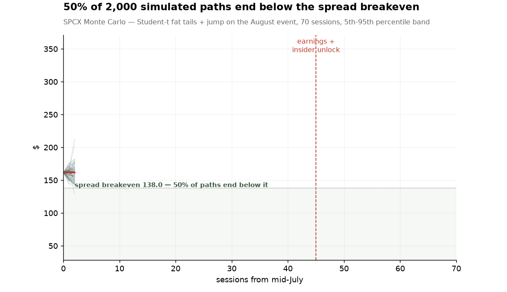
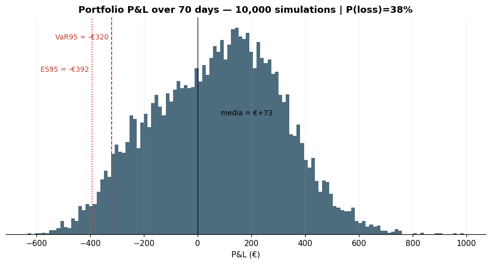
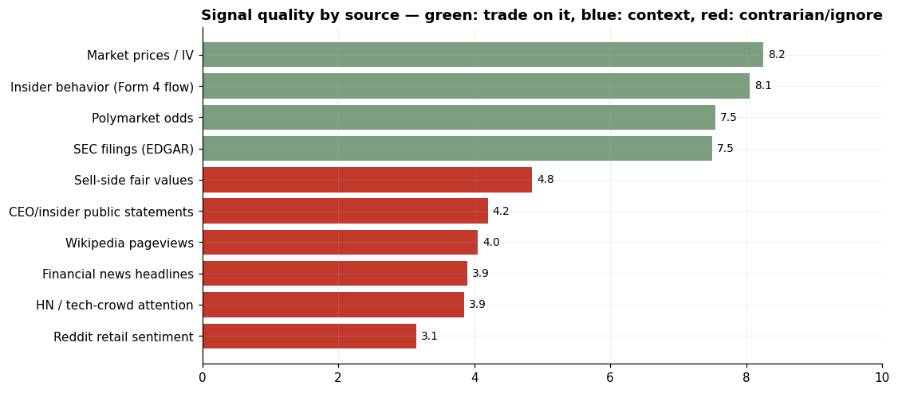
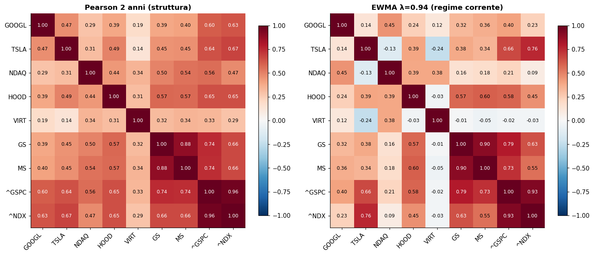
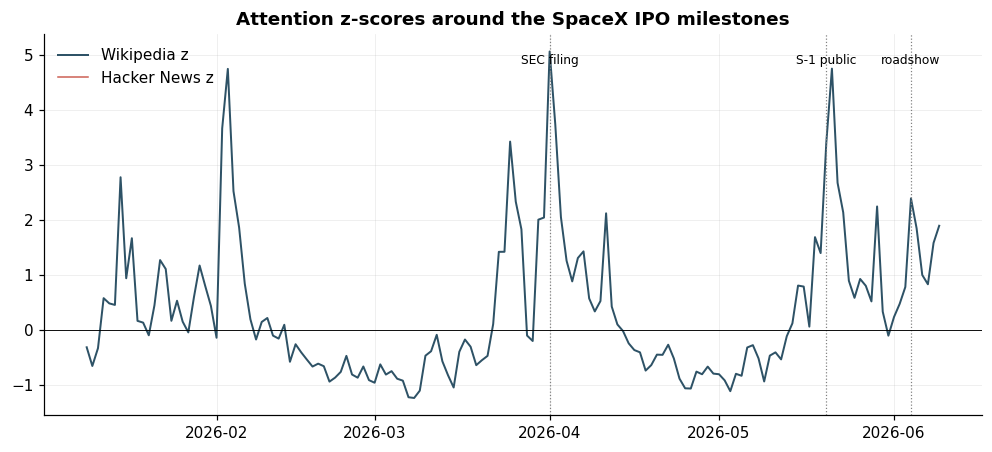
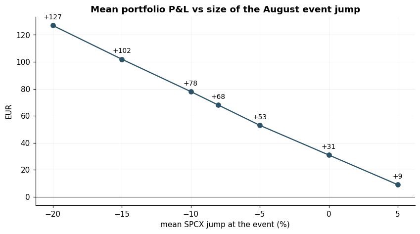
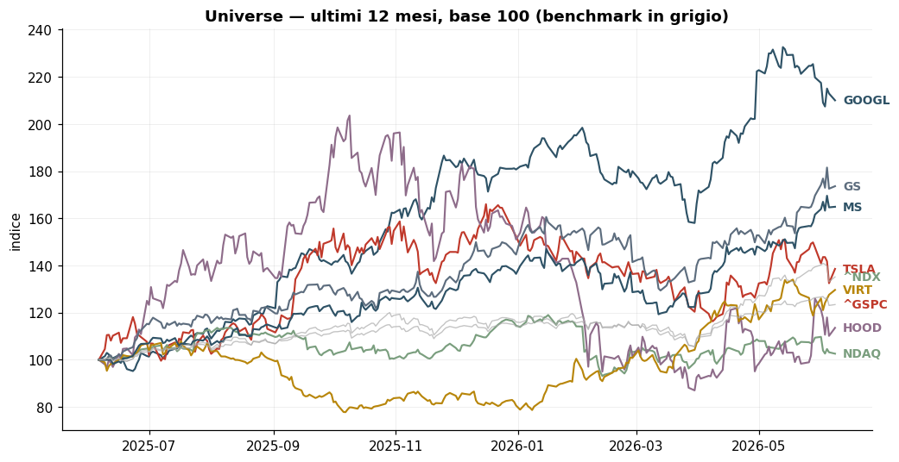

<div align="center">


# One retail investor, a small account, and an AI<br>vs the largest IPO in history

**A documented, falsifiable experiment**: can a frontier model (Fable 5, Anthropic) close the
information and competence gap between a small retail investor and institutional players?
Test bench: the SpaceX IPO of June 12, 2026 — a $1.75T valuation, 94x revenue, and the most
unusual insider lockup ever filed.


<br>
<sub><b>2,000 Monte Carlo paths</b> — Student-t innovations (empirically validated fat tails) + jump on the earnings/insider-unlock event</sub>

</div>

---

## The idea, briefly

On June 12, 2026 SpaceX lists on Nasdaq: the biggest IPO ever. Analysts call it 55%
overvalued (Morningstar), Reddit calls it "the theft of the century", Polymarket prices the
pop at 60%, and insiders get to sell on an accelerated unlock schedule nobody has seen before.

A small retail investor normally walks into this with FOMO and zero tooling. In this repo,
a human and an AI built what an institutional desk would instead: multi-source research,
valuation work, defined-risk strategies, a Monte Carlo validated against real return
distributions, an event study on historical lockups, signal-quality engineering, tax
analysis — and a **ledger of falsifiable predictions** written BEFORE the debut.

In a few months everything gets reopened and scored: [**PREDICTIONS.md**](PREDICTIONS.md)
is the contract with the future — git history is the witness.

## The numbers on June 10, 2026 (T-2 to the debut)

| | |
|---|---|
| IPO pricing | $135/share · $1.75T valuation · $75B raise (all-time record) |
| Morningstar fair value | $780B (**-55%** from IPO price) · 94x revenue vs Nvidia's ~22x |
| The structural flaw | xAI burns >$6B/year inside SpaceX; Starlink (61% of revenue) is profitable |
| The anomaly | insiders may sell 20% **two days after the first earnings report** (vs the standard 180 days) |
| Polymarket (real money) | 99% day-1 close above $1T · 60.5% above $2T |
| The plan | 60% quality proxy (GOOGL) · 20% defined-risk put spread on the lockup · 20% cash · max loss hard-capped ~20% |

## The quant research, at a glance

<div align="center">
<table>
<tr>
<td align="center"><br><sub><b>Plan P&L distribution</b> — 10k simulations, VaR/ES annotated: right tail capped by the spread, left tail is all equity beta</sub></td>
<td align="center"><br><sub><b>Signal quality rubric</b> — skin-in-the-game beats talk: trade on green, treat blue as context, fade red</sub></td>
</tr>
<tr>
<td align="center"><br><sub><b>Correlations</b> — 2-year structure vs current regime (EWMA λ=0.94): how much of the hedge is illusion</sub></td>
<td align="center"><br><sub><b>Attention engineering</b> — cleaned Wikipedia/HN z-scores vs IPO milestones; the lead-lag test shows attention follows price</sub></td>
</tr>
<tr>
<td align="center"><br><sub><b>Sensitivity</b> — the plan lives or dies on the August event jump: positive EV needs ≤ -5%</sub></td>
<td align="center"><br><sub><b>Universe</b> — portfolio, picks-and-shovels and space sector: the best risk-adjusted shovel is VIRT, not HOOD</sub></td>
</tr>
</table>
</div>

**The finding that corrected the thesis** — an event study on 4 historical lockups (UBER,
RIVN, META, SNAP) shows the drop happens in *anticipation* (-37 points on average in the 30
sessions before expiry) and the unlock day itself is often a local bottom. Sell the rumor,
buy the news: the exit rule was rewritten accordingly (close within T+5 of the unlock).

## What's in the repo

```
notebooks/00_master_report.ipynb     ← OPEN THIS: runs everything, outputs embedded
notebooks/01..04                     data pipeline · correlations · Monte Carlo · signal quality
docs/01..08                          thesis · strategies with full math · timeline ·
                                     risk management · tax case study · trade journal ·
                                     capital tiers (€1k to €10M+) · closing the enterprise gap
docs/html/                           the notebooks as plain HTML (double-click, zero setup)
src/connectors/                      SEC EDGAR · Polymarket · FRED · yfinance+Stooq · HN · Wikipedia
src/risk/ · src/research/            metrics, Monte Carlo, lockup event study,
                                     fat-tail validation, signal-quality framework
PREDICTIONS.md                       the falsifiable ledger — the heart of the experiment
EVALUATION.md                        pre-registered evaluation protocol + honest limits
checkpoints/                         frozen data snapshots at every milestone (tools/checkpoint.py)
```

## Reproduce everything

```bash
python3 -m venv .venv && .venv/bin/pip install -r requirements.txt
.venv/bin/python tools/build_master.py          # rebuilds + executes all 5 notebooks on fresh data
./tools/run_tests.sh                            # full smoke-test suite (12 modules, must print 12/12 PASS)
.venv/bin/python tools/checkpoint.py <label>    # freeze a dated evidence snapshot (see EVALUATION.md)
```

To read the notebooks with no setup at all: open `docs/html/` in a browser, or let GitHub
render them online. In VS Code: Jupyter extension + the venv kernel created above.

## Why this repo exists

Not for the P&L — a small account with declared EV≈0 changes nobody's life. It exists to
answer, with data and at the cost of public embarrassment, a serious question: **can AI give
someone with two thousand euros the tools of someone managing two trillion?** The working
hypothesis after building it (see `docs/07`): AI compresses the *analysis* gap to nearly
zero; the *access* gap — allocations, OTC, borrow, pre-IPO secondaries — is still plumbing
that no model can route around. The honest answer lands in the Outcome column of
[PREDICTIONS.md](PREDICTIONS.md).

---

<div align="center">
<sub>
Nothing in this repo is financial advice. It is a documented experiment, run with capital the
author can afford to lose and rules written before the events.<br>
The SpaceX logo belongs to Space Exploration Technologies Corp. — used here for identification only.
</sub>
</div>
