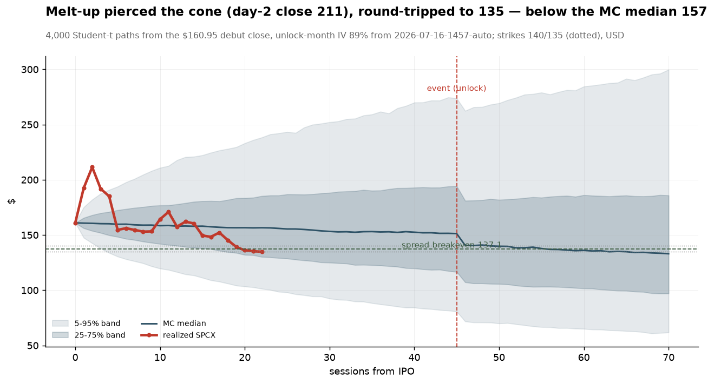
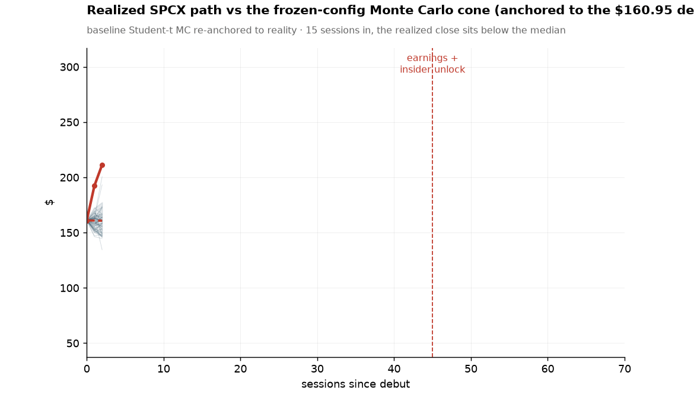

<div align="center">


# One retail investor, a small account, and an AI<br>vs the largest IPO in history

**A documented, falsifiable experiment**: can a frontier model (Fable 5, Anthropic) close the
information and competence gap between a small retail investor and institutional players?
Test bench: the SpaceX IPO of June 12, 2026 — a $1.75T valuation, 94x revenue, and the most
unusual insider lockup ever filed.


<br>
<sub><b>2,000 Monte Carlo paths</b> — Student-t innovations (empirically validated fat tails) + jump on the earnings/insider-unlock event</sub>

</div>

---

## The story so far

Two days before the largest IPO in human history, a retail investor with a small account
asked an AI a simple question: *is this a once-in-a-generation opportunity, or the most
elaborate exit liquidity event ever staged?*

The honest answer turned out to be neither — and getting there took an evening of actual
work. Analysts call SpaceX 55% overvalued (Morningstar). Reddit calls it "the theft of the
century". Polymarket prices the day-1 pop at 60%. And the S-1 contains a lockup clause
nobody has seen before: insiders free to sell 20% of their stock **two days after the first
earnings report**, instead of the usual six months.

A retail investor normally walks into this with FOMO and a brokerage app. This repo walks
in with what an institutional desk would bring instead: multi-source research, valuation
work, defined-risk strategies, a Monte Carlo validated against real return distributions,
an event study on every comparable lockup since 2012, signal-quality engineering, tax math —
and a **ledger of falsifiable predictions, written and frozen before the debut**.

In a few months everything gets reopened and scored. [**PREDICTIONS.md**](PREDICTIONS.md)
is the contract with the future; git history is the notary.

## Follow along — the experiment in real time

| | Date | Milestone | Evidence frozen |
|---|---|---|---|
| ✅ | Jun 10, 2026 | Research, plan, predictions — all pre-registered | `checkpoints/2026-06-10-baseline` |
| ✅ | Jun 12 | **The debut** — P1 and P2 both resolved **TRUE** (+19.2% pop, $2.105T cap) | `checkpoints/…-day1-score`, `checkpoints/SCORING.md` |
| ✅ | Jun 18 | SPCX options listed: the model's guessed IV met reality (70% assumed vs ~88% real) | [`notebooks/06`](notebooks/06_post_ipo_review.ipynb) |
| ✅ | Jul 6-17 | Spread entry window — IV **83-87% > 55% gate** → written **stand-down**, no order | [`notebooks/07`](notebooks/07_entry_decision.ipynb) · checkpoint `entry-window` |
| ⏳ | ~Aug | First earnings + the insider unlock (the whole thesis) | checkpoints `earnings-T`, `unlock-T7` |
| ⏳ | ~Oct 25 | Day 135: lockup fully open, first "true" price | checkpoint `day135` |
| ⏳ | Dec 31 | Final scoring — every prediction gets its Outcome | checkpoint `final`, then `VERDICT.md` |

<sub>The record keeps itself: a GitHub Action snapshots every data source twice a week
(Polymarket odds, SPCX option chains with IV, prices, filings — the things that cannot be
reconstructed later), with no local machine involved. Milestone labels are fired manually
from the Actions tab.</sub>

## Post-IPO update — the model meets the market (updated Jul 16, 2026)

The debut happened. SpaceX priced at $135, melted up to a $211 close on day 2, then gave the
whole move back — ~$135 by mid-July. The entry-window layer ([`notebooks/07_entry_decision.ipynb`](notebooks/07_entry_decision.ipynb),
frozen in `checkpoints/2026-07-06-entry-window`) records the first live decision; the chart
below is the *living* version of its overlay, regenerated from the latest frozen checkpoint by
[`tools/make_mc_vs_realized.py`](tools/make_mc_vs_realized.py). (Calibration scoring of the
day-1 predictions lives separately in [`notebooks/06`](notebooks/06_post_ipo_review.ipynb).)

<div align="center">
<br>
<sub><b>Realized SPCX vs the realized-IV Monte Carlo cone</b> — the initial IPO froth briefly
pierced the 95% band (the model under-called the melt-up), then price round-tripped through
the median to the 140/135 strikes (dotted). Cone propagated with the archived unlock-month
ATM IV; evidence checkpoint named in the subtitle.</sub>
</div>

**First live decision — stand-down, twice.** Strategy B enters only if *September ATM IV < 55%*
**and** spot > $140 **and** debit ≤ $2.30. On Jul 6 spot ($162) and debit (~$1.99) passed,
but realized IV was **~83-87%** — the IV crush never came; per the pre-written Phase-2
fallback, **no option was bought** (inflated IV is a gift to the market maker). By the window
close (Jul 16) the anticipated drop had arrived *without* a position — spot $135.27, debit
$2.89 — and **all three gates failed**: the front-run case the plan pre-registered as its
invalidation. Cash stayed cash; the Jul 24 relaxed retry is expected to formally cancel
Strategy B. Full record in [`docs/06-trade-journal.md`](docs/06-trade-journal.md) §2 #001.

## The numbers on June 10, 2026 (T-2 to the debut)

| | |
|---|---|
| IPO pricing | $135/share · $1.75T valuation · $75B raise (all-time record) |
| Morningstar fair value | $780B (**-55%** from IPO price) · 94x revenue vs Nvidia's ~22x |
| The structural flaw | xAI burns >$6B/year inside SpaceX; Starlink (61% of revenue) is profitable |
| The anomaly | insiders may sell 20% **two days after the first earnings report** (vs the standard 180 days) |
| Polymarket (real money) | 99% day-1 close above $1T · 60.5% above $2T |
| The plan | 60% quality proxy (GOOGL) · 20% defined-risk put spread on the lockup · 20% cash · max loss hard-capped ~20% |

## Retail vs enterprise, with no sugarcoating

How much of each institutional layer can a retail investor + AI actually reach today?
Full analysis in [EVALUATION.md](EVALUATION.md) §5, mitigation playbook in
[docs/08-closing-the-gap.md](docs/08-closing-the-gap.md).

| Layer | Reachable today | | How |
|---|---|---|---|
| Process discipline | `▰▰▰▰▰▰▰▰▰▱` | ~90% | pre-registration, journals, checkpoints — pure will, €0 |
| Models | `▰▰▰▰▰▰▰▱▱▱` | ~50-70% | open-source MC/GARCH, free academic factors, validated fat tails |
| Data | `▰▰▰▰▰▱▱▱▱▱` | ~40-60% | EDGAR, Polymarket, FRED free; intraday/IV for <$300; self-archived checkpoints |
| Execution | `▰▰▱▱▱▱▱▱▱▱` | ~20% | refuse the speed game: limit orders, weeks-long horizons, smallness as edge |
| Access | `▰▱▱▱▱▱▱▱▱▱` | ~10-20% | securities lending, defined-risk option replication — the rest is bought |

> Summed up where it matters for position trading: **roughly half** of a desk's capability,
> up from ~5% pre-AI. The bet of this experiment: the reachable half is the half that
> prevents ruin.

**A note on currency.** Amounts are in EUR on purpose: this is deliberately a *European*
retail experiment, and the frictions that come with that — EUR/USD exposure, the PRIIPs
rules that block US ETFs, local taxation — are not glossed over but engineered around
([docs/02](docs/02-strategies.md), [docs/05](docs/05-tax-italy.md)). The EURUSD rate is
frozen in every checkpoint, the prediction hard-caps are expressed in percentages, and a
US reader can mentally substitute dollars everywhere except those two documents. An
experiment that pretended to be currency-less would be hiding exactly the constraints
that make retail reality different from a textbook.

## The quant research, at a glance

<div align="center">
<table>
<tr>
<td align="center"><br><sub><b>Plan P&L distribution</b> — 10k simulations; red mass = losing region; the left tail is all equity beta, the spread is hard-capped</sub></td>
<td align="center"><br><sub><b>Spread payoff vs simulated outcomes</b> — profit/loss zones shaded over the density of final SPCX prices</sub></td>
</tr>
<tr>
<td align="center"><br><sub><b>Sensitivity, decomposed</b> — judge the trade on the spread-only line: the total is padded by the GOOGL drift assumption</sub></td>
<td align="center"><br><sub><b>Signal quality rubric</b> — what people DO with money outranks what they SAY; thresholds mark context vs trade-on-it</sub></td>
</tr>
<tr>
<td align="center"><br><sub><b>Correlations</b> — 2-year structure vs current regime; the boxed cell is the "Musk beta" (GOOGL×TSLA)</sub></td>
<td align="center"><br><sub><b>Attention timeline</b> — cleaned Wikipedia/HN z-scores spike ON the milestones: they confirm, they don't anticipate</sub></td>
</tr>
<tr>
<td align="center"><br><sub><b>Universe</b> — direct labels with 12-month change; the best risk-adjusted shovel is VIRT, not HOOD</sub></td>
<td align="center"><br><sub><b>Diversification dead zone</b> — how often the defensive tranche stops diversifying exactly when needed</sub></td>
</tr>
</table>
</div>

## Data quality engineering — garbage in, garbage out, audited

A dedicated notebook (`05_data_quality`) audits every input: coverage scorecards,
issues-vs-warnings triage, and the pipeline bugs the gates caught — **shown, not hidden**.

<div align="center">
<table>
<tr>
<td align="center"><br><sub><b>Coverage scorecard</b> — per-ticker business-day coverage; blocking issues vs human-review warnings</sub></td>
<td align="center"><br><sub><b>Flagged outliers, inspected</b> — every >50% move survived review (real events): warn, never auto-drop</sub></td>
</tr>
<tr>
<td align="center"><br><sub><b>The pagination bug, visualized twice</b> — naive fixes lost history silently; only time-windowed pagination covers the request</sub></td>
<td align="center"><br><sub><b>Winsorization, accounted for</b> — every clipped point marked and counted; for prices the spikes are information, for attention they are noise</sub></td>
</tr>
</table>
</div>

**The finding that corrected the thesis** — an event study on 4 historical lockups (UBER,
RIVN, META, SNAP) shows the drop happens in *anticipation* (-37 points on average in the 30
sessions before expiry) and the unlock day itself is often a local bottom. Sell the rumor,
buy the news: the exit rule was rewritten accordingly (close within T+5 of the unlock).

## Two weeks in — predicted vs realized (the pre-registration stays frozen)

The debut happened. [`notebooks/06_post_ipo_review.ipynb`](notebooks/06_post_ipo_review.ipynb) is
an **added** scoring layer — it never edits `PREDICTIONS.md`, the metrics, or the baseline charts;
it reads the **frozen** day-1 checkpoint and pre-debut odds and holds them against live reality.

<div align="center">
<br>
<sub><b>Realized path vs the frozen-config Monte Carlo cone</b> — the baseline Student-t MC
re-anchored to the real $160.95 debut close, the realized SPCX path (red) revealed on top.
Twenty-three sessions in, the pop has fully <b>round-tripped</b>: a spike to ~$211 (briefly above
the frozen 95th percentile) unwound through the median to ~$135 — back to the IPO price, in the
lower half of the cone, still inside it. Every post-IPO visual reads the same frozen-checkpoint
evidence (<code>tools/evidence.py</code>), so the gif, this cone and
<a href="assets/chart_post_ipo.png">chart_post_ipo.png</a> always agree. Static version:
<a href="assets/chart_post_ipo.png">chart_post_ipo.png</a></sub>
</div>

| | Pre-registered / market expectation | Realized | Verdict |
|---|---|---|---|
| **P1** cap > $1T | our P 0.97 · Polymarket ~0.99 | $2.105T | **TRUE** ✓ |
| **P2** cap > $2T | our P 0.60 · Polymarket ~0.63 | $2.105T | **TRUE** ✓ |
| Day-1 pop | — | $135 → $160.95 = **+19.2%** | — |
| **IV reality check** | MC assumed **70%** vol | listed ATM IV (Aug unlock) **~88%** | model **under-vol'd by ~18pts** |

Calibration held (crowd and our P both on the right side of $2T, near its probability); the model
under-priced volatility, so the July put spread is richer than the baseline implied — judge the
entry on real IV, exactly as the sensitivity note warned. The two-week round-trip from $211 back to
$153 is that under-priced vol made visible: the day-1 fact stays frozen and TRUE, while the
post-debut tape does what 88% IV said it would. Full scoring in
[`checkpoints/SCORING.md`](checkpoints/SCORING.md). The July spread entry was then evaluated on
Jul 6 and **stood down** — IV ~83-87% never cleared the 55% gate (see the post-IPO section above and
[`notebooks/07`](notebooks/07_entry_decision.ipynb)). Still ahead: the August earnings + insider
unlock, and `form4_watch()` going live.

## What's in the repo

```
notebooks/00_master_report.ipynb     ← OPEN THIS: runs everything, outputs embedded
notebooks/01..05                     data pipeline · correlations · Monte Carlo · signal quality ·
                                     data-quality audit  (frozen baseline, pre-IPO)
notebooks/06_post_ipo_review.ipynb   predicted-vs-realized scoring layer (P1/P2 calibration)
notebooks/07_entry_decision.ipynb    entry-window layer: real IV, MC-vs-realized overlay, stand-down
docs/01..08                          thesis · strategies with full math · timeline ·
                                     risk management · tax case study · trade journal ·
                                     capital tiers (€1k to €10M+) · closing the enterprise gap
docs/html/                           the notebooks as plain HTML (double-click, zero setup)
src/connectors/                      SEC EDGAR · Polymarket · FRED · yfinance+Stooq · HN · Wikipedia
src/risk/ · src/research/            metrics, Monte Carlo, lockup event study,
                                     fat-tail validation, signal-quality framework
PREDICTIONS.md                       the falsifiable ledger — the heart of the experiment
EVALUATION.md                        pre-registered evaluation protocol + honest limits
LOGBOOK.md                           append-only build chronology: decisions and bugs, dated
checkpoints/                         frozen data snapshots at every milestone (tools/checkpoint.py)
```

## Reproduce everything

```bash
python3 -m venv .venv && .venv/bin/pip install -r requirements.txt
./tools/run_tests.sh                            # smoke-test suite (12 modules, must print 12/12 PASS)
.venv/bin/python -m pytest -q                   # unit tests (19, must all pass)
.venv/bin/python tools/build_master.py          # rebuild + execute the baseline notebooks on fresh data
.venv/bin/python tools/build_notebook_07.py     # rebuild the entry-window layer (reads the frozen checkpoint)
.venv/bin/python tools/checkpoint.py <label>    # freeze a dated evidence snapshot (see EVALUATION.md)
```

**Verify the frozen evidence (no trust required).** Every checkpoint carries a `MANIFEST.json`
with a SHA256 per artifact, the git HEAD, and the pip freeze — so a third party can confirm
the snapshot was not edited after the fact:

```bash
# recompute each artifact's hash and diff against the manifest
.venv/bin/python - <<'PY'
import json, hashlib, pathlib
ck = pathlib.Path("checkpoints/2026-07-06-entry-window")
man = json.load(open(ck/"MANIFEST.json"))
for name, want in man["artifacts"].items():
    got = hashlib.sha256((ck/name).read_bytes()).hexdigest()[:16]
    print(f"{'OK ' if got==want else 'MISMATCH'} {name}")
PY
```

The realized parameters that feed the model are auditable end-to-end, all inside the frozen
checkpoint (`data/` is scratch and gitignored — the snapshots are the evidence): full SPCX
price history in `spcx_ohlcv.parquet`, the archived IV term structure in `spcx_market.json`
(`derived_atm_iv`, back-solved from the option `lastPrice` because the free feed carries no
live bid/ask), and the Monte Carlo inputs/outputs in `montecarlo.json`.

To read the notebooks with no setup at all: open `docs/html/` in a browser, or let GitHub
render them online. In VS Code: Jupyter extension + the venv kernel created above.

## Why this repo exists

Not for the P&L — a small account with declared EV≈0 changes nobody's life. It exists to
answer, with data and at the cost of public embarrassment, a serious question: **can AI give
someone with two thousand euros the tools of someone managing two trillion?** The working
hypothesis after building it (see `docs/07`): AI compresses the *analysis* gap to nearly
zero; the *access* gap — allocations, OTC, borrow, pre-IPO secondaries — is still plumbing
that no model can route around. The honest answer lands in the Outcome column of
[PREDICTIONS.md](PREDICTIONS.md).

## A note to whoever reopens this repo months from now

Maybe it's the author. Maybe it's another AI, asked to grade the first one. Either way:

1. Don't trust your memory of how this played out — load `checkpoints/` and compare frozen
   snapshots. Live data sources revise themselves; the snapshots don't.
2. The rules of the game are in [EVALUATION.md](EVALUATION.md) and they were written before
   the events. Changing the metrics now is cheating; say so if you catch yourself doing it.
3. [LOGBOOK.md](LOGBOOK.md) records what was decided when, and which bugs the process caught.
   The mistakes are part of the dataset — that was the point.
4. Whatever the P&L says, the question to answer is the one above: did the analysis hold up,
   were the probabilities calibrated, did the discipline survive contact with the market?

Write `VERDICT.md`. Be harsher than feels polite.

---

<div align="center">
<sub>
Nothing in this repo is financial advice. It is a documented experiment, run with capital the
author can afford to lose and rules written before the events.<br>
The SpaceX logo belongs to Space Exploration Technologies Corp. — used here for identification only.
</sub>
</div>
